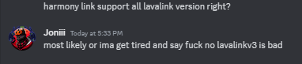

<a name="readme-top"></a>


<br/>

<div align="center">
  <a href="https://github.com/Joniii11/HarmonyLink">
    
  </a>

<h3 align="center">HarmonyLink</h3>

  <p align="center">
    Seamlessly connect to LavaLink nodes for high-quality audio streaming in your applications. 
    <br />
    <a href="https://github.com/Joniii11/HarmonyLink"><strong>Explore the docs »</strong></a>
    <br />
  <br />
    <a href="#demo">View Demo</a>
    ·
    <a href="https://github.com/Joniii11/HarmonyLink/issues/new?labels=bug&template=bug-report---.md">Report Bug</a>
    ·
    <a href="https://github.com/Joniii11/HarmonyLink/issues/new?labels=enhancement&template=feature-request---.md">Request Feature</a>
  </p>
   <h4>Built With</h4>

  [![TypeScript][ts]][ts-url]

  [![Contributors][contributors-shield]][contributors-url]
[![Forks][forks-shield]][forks-url]
[![Stargazers][stars-shield]][stars-url]
[![Issues][issues-shield]][issues-url]
[![MIT License][license-shield]][license-url]

<br>
 <a href="https://nodei.co/npm/poru/">
    
    </a>
</div>

> [!WARNING]  
> Support for Lavalink Version 3 is planned, but not confirmed to be made <a href="#warning">more info.</a>

<details>
  <summary>Table of Contents</summary>
  <ol>
    <li>
      <a href="#about">About</a>
      <ul>
        <li><a href="#demo">Demo</a></li>
        <li><a href="#built-with">Built With</a></li>
      </ul>
    </li>
    <li>
      <a href="#getting-started">Getting Started</a>
      <ul>
        <li><a href="#prerequisites">Prerequisites</a></li>
        <li><a href="#installation">Installation</a></li>
      </ul>
    </li>
    <li><a href="#example-usage">Example Usage</a></li>
    <li><a href="#contributing">Contributing</a></li>
    <li><a href="#license">License</a></li>
    <li><a href="#warning">Warning</a></li>
  </ol>
</details>

## About

[![Product Name Screen Shot][product-screenshot]](https://github.com/Joniii11/HarmonyLink)

Seamlessly connect to LavaLink nodes for high-quality audio streaming in your applications. HarmonyLink offers a reliable and easy-to-use interface, perfect for building music bots and audio applications with superior performance.

<p align="right">(<a href="#readme-top">back to top</a>)</p>

### Demo:

| URL | Features | Additional Information |
|-----|----------|------------------------|
| [RhythmCore](https://rhythmcorehq.com/) | Advanced Music bot With AI | [Invite](https://discord.com/oauth2/authorize?client_id=971355817280430110&permissions=279176400136&scope=applications.commands+bot) |
| [Example Bot](https://github.com) | Verry basic example bot | coming soon |

<p align="right">(<a href="#readme-top">back to top</a>)</p>

## Getting Started

Here is how to install HarmonyLink on your project.

### Prerequisites
* npm
  ```sh
  npm install npm@latest -g
  ```

### Installation
1. Install HarmonyLink
   ```sh
   npm install harmonyLink@latest
   ```
2. idk 
   ```sh
   hey tell me what to run as a cmd here joniiiii
   ```
3. idk config ig
   ```js
   import { DJSLibrary } from "HarmonyLink";
   ```

<p align="right">(<a href="#readme-top">back to top</a>)</p>

## Example Usage

Cuming soon

_For more examples, please refer to the [Documentation](https://github.com/Joniii11/HarmonyLink)_

<p align="right">(<a href="#readme-top">back to top</a>)</p>

## Contributing

Contributions are what make the open source community such an amazing place to learn, inspire, and create. Any contributions you make are **greatly appreciated**.

If you have a suggestion that would make this better, please fork the repo and create a pull request. You can also simply open an issue with the tag "enhancement".
Don't forget to give the project a star! Thanks again!

1. Fork the Project
2. Create your Feature Branch (`git checkout -b feature/AmazingFeature`)
3. Commit your Changes (`git commit -m 'Add some AmazingFeature'`)
4. Push to the Branch (`git push origin feature/AmazingFeature`)
5. Open a Pull Request

<p align="right">(<a href="#readme-top">back to top</a>)</p>

## License

Distributed under the MIT License. See `LICENSE` for more information.

<p align="right">(<a href="#readme-top">back to top</a>)</p>

## Warning



<p align="right">(<a href="#readme-top">back to top</a>)</p>


[contributors-shield]: https://img.shields.io/github/contributors/Joniii11/HarmonyLink.svg?style=for-the-badge
[contributors-url]: https://github.com/Joniii11/HarmonyLink/graphs/contributors
[forks-shield]: https://img.shields.io/github/forks/Joniii11/HarmonyLink.svg?style=for-the-badge
[forks-url]: https://github.com/Joniii11/HarmonyLink/network/members
[stars-shield]: https://img.shields.io/github/stars/Joniii11/HarmonyLink.svg?style=for-the-badge
[stars-url]: https://github.com/Joniii11/HarmonyLink/stargazers
[issues-shield]: https://img.shields.io/github/issues/Joniii11/HarmonyLink.svg?style=for-the-badge
[issues-url]: https://github.com/Joniii11/HarmonyLink/issues
[license-shield]: https://img.shields.io/github/license/Joniii11/HarmonyLink.svg?style=for-the-badge
[license-url]: https://github.com/Joniii11/HarmonyLink/blob/master/LICENSE.txt
[product-screenshot]: images/screenshot.png
[ts]: https://img.shields.io/badge/TypeScript-007ACC?logo=typescript&logoColor=white
[ts-url]: https://www.typescriptlang.org/
